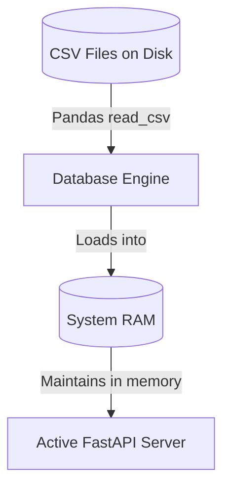
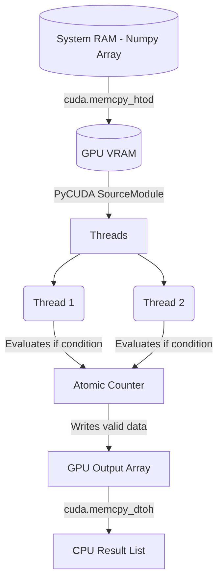
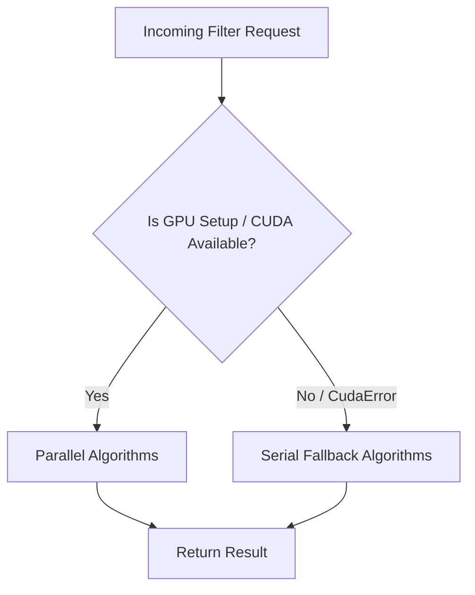

# System Flows
This document explicitly maps out the step-by-step logic for how the web dashboard interacts with the PyCUDA backend, and how data flows from the hard drive, into system RAM, down to the GPU, and back up to the user interface.

## 0. System Component Interaction Flow
This flowchart maps exactly how the frontend UI and the Python backend interact via HTTP, and how the GPU accelerates the queries:

```mermaid
graph TD
    User((User)) -->|Clicks Execute on UI| Dash[Web Dashboard (app.js)]
    Dash -->|HTTP POST JSON| Main[FastAPI main.py]
    Main -->|Routes Request| QO[QueryOptimizer]
    QO -.->|Fetches arrays| DB[(DatabaseEngine / RAM)]
    QO -->|1. Executes Baseline| SA[SerialAlgorithms (CPU/Python)]
    QO -->|2. Executes CUDA| PA[ParallelAlgorithms (NVIDIA GPU)]
    SA -.->|Returns Time & Data| QO
    PA -.->|Returns Time & Data| QO
    QO -->|3. Calculates Speedup| Main
    Main -->|HTTP Response JSON| Dash
    Dash -->|Updates Table & Chart| User
```

---

## 1. Flow of Data Initialization (Server Startup)



### The Initialization Flow
1.  **FastAPI Startup:** The `main.py` script starts the event loop (`@app.on_event("startup")`).
2.  **Pandas Loading:** The `DatabaseEngine.initialize()` reads the gigantic CSV files from the drive.
3.  **In-Memory Store:** The parsed records are stored as Pandas DataFrames in server memory, bypassing disk reads for subsequent GPU queries.

---

## 2. Flow of Hardware Parallelization (PyCUDA Filtering)



### The Parallel Flow
1.  **Preparation (CPU side):** PyCUDA (`cuda.mem_alloc`) allocates contiguous memory space directly on the NVIDIA GPU.
2.  **Data Transfer:** `cuda.memcpy_htod` copies the active Numpy array from the host RAM to the device VRAM. This is often the most expensive operation in HPC.
3.  **Kernel Execution:** The C++ `__global__` PyCUDA kernels execute simultaneously over Blocks and Grids.
4.  **Data Race Prevention:** `atomicAdd(count, 1)` enables thousands of threads to successfully append valid matches to a shared array without overwriting each other.
5.  **Result Retrieval:** `cuda.memcpy_dtoh` takes the successfully matched elements and brings them back to system RAM as a python list, releasing the VRAM.

---

## 3. Flow of Error Handling (CUDA Fallback)



### The Fallback Flow
1. To ensure the Web application does not completely break if deployed to a host lacking an NVIDIA GPU (or missing device drivers), a safety wrapper evaluates the `try/catch` of PyCUDA initialization.
2. If CUDA compilation fails, the system bypasses `ParallelAlgorithms` and exclusively runs the raw Python loops inside `SerialAlgorithms`, still returning valid data but lacking hardware speedup.
