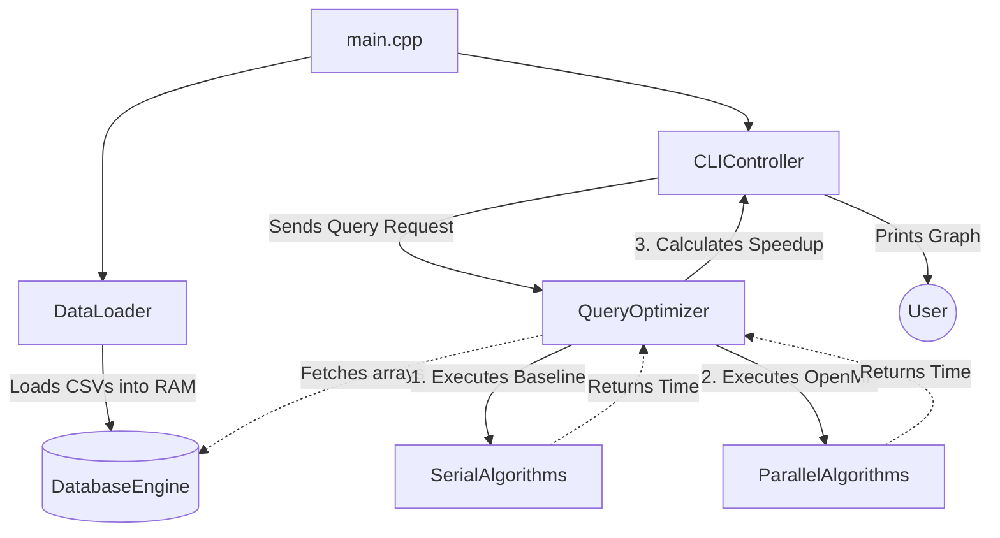
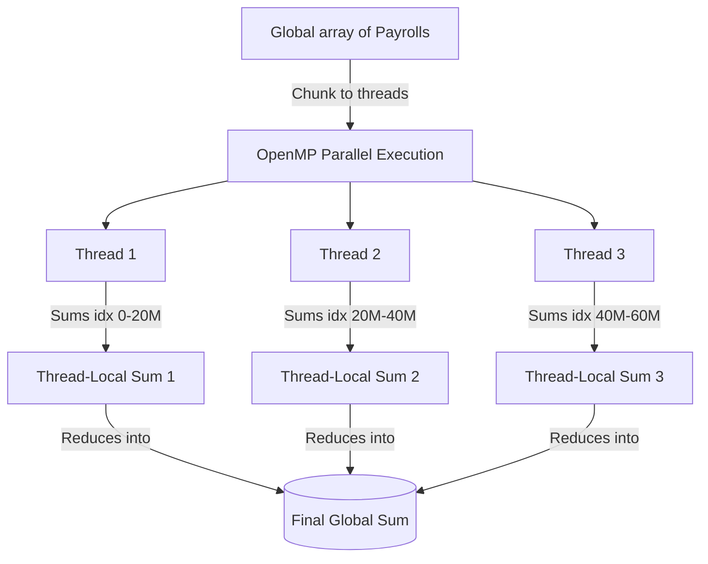
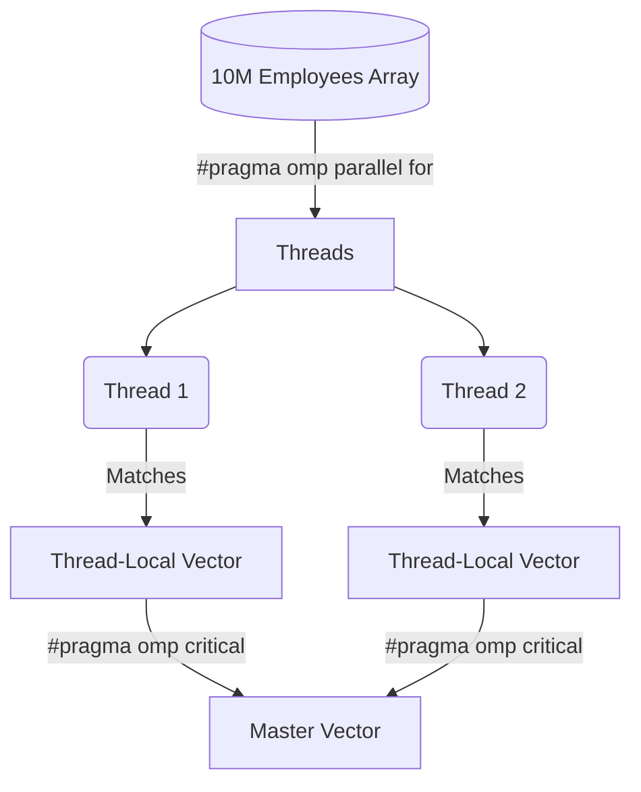
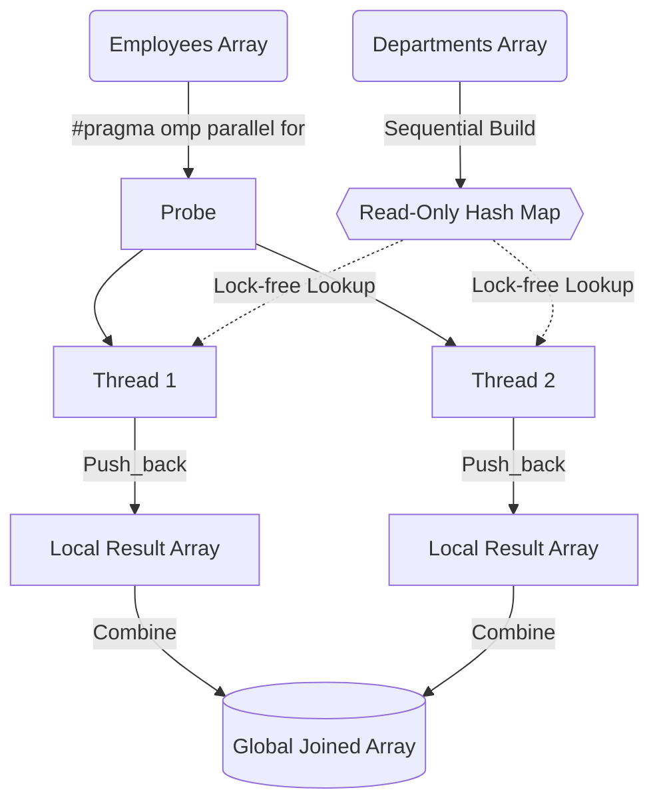
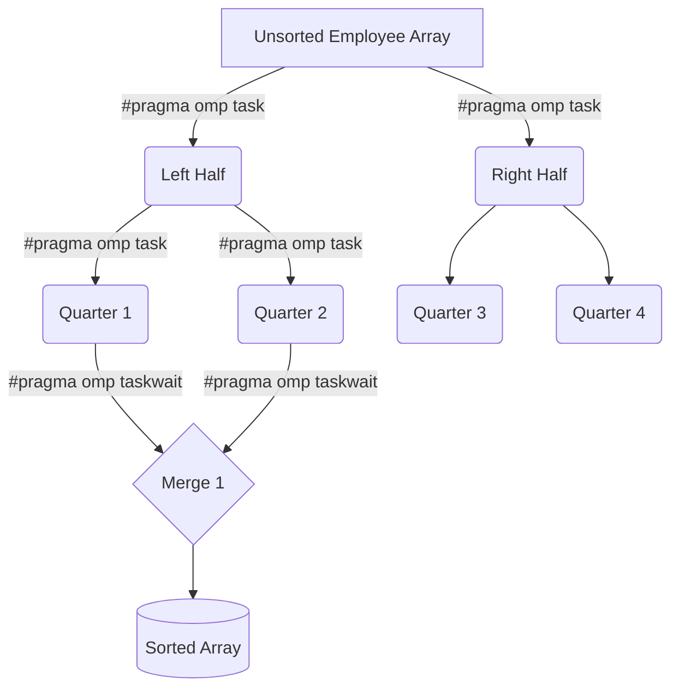
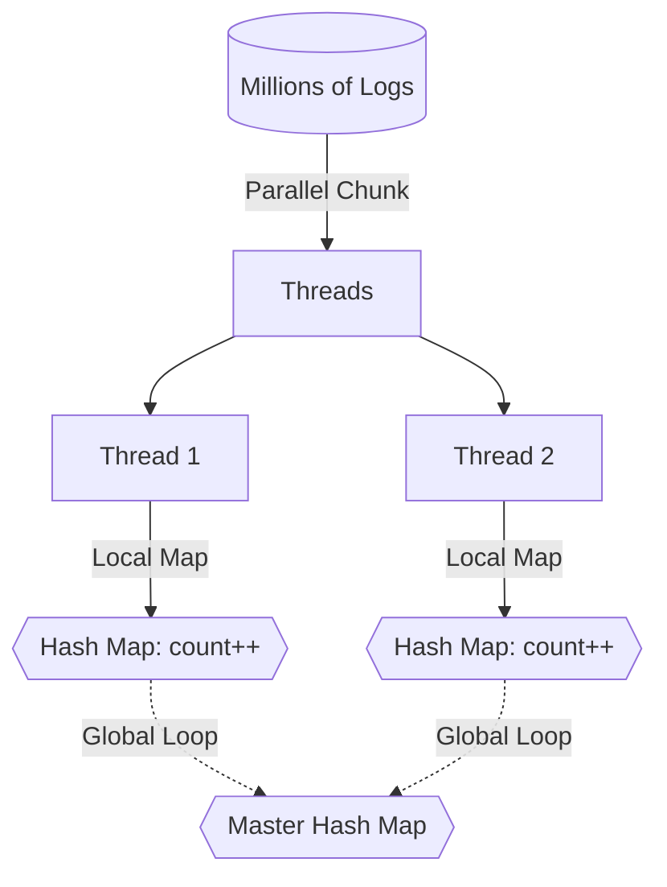
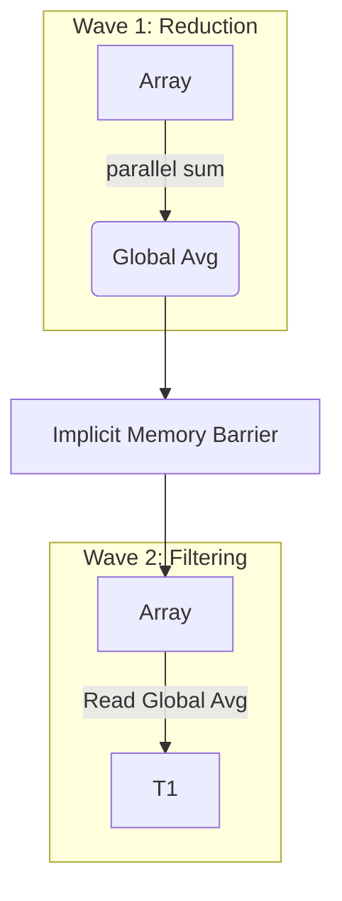

# System Flows
This document explicitly maps out the step-by-step logic for how the Object-Oriented components interact, as well as how the Sequential algorithms work versus how the OpenMP Parallel algorithms handle physical memory architecture.

## 0. System Component Interaction Flow
This flowchart maps exactly how the classes defined in `class_architecture.md` interact with each other during a user's session:

---

## 1. Flow of Aggregation (`SUM`, `AVG`)

### The Parallel Flow
1.  **Initialize Variables:** Create a global `double total_sum = 0;`
2.  **Thread Setup:** The program hits `#pragma omp parallel for reduction(+:total_sum)`.
3.  **Array Chunking:** OpenMP divides the records into chunks.
4.  **Local Accumulation:** OpenMP gives every thread its own private, isolated copy of `total_sum` (Preventing Race Conditions).
5.  **Recombination (The Reduction Phase):** OpenMP safely adds the local sums together into the original global `total_sum`.

---

## 2. Flow of Filtering (`WHERE` clause)

### The Parallel Flow
1.  **Preparation:** OpenMP cannot safely do a `push_back()` to a single array from multiple threads.
2.  **Thread Local Storage:** Each thread creates its own isolated `std::vector` inside the parallel region.
3.  **Chunk Processing:** `#pragma omp for` divides the huge Employee array.
4.  **Global Combination:** After filtering, a `#pragma omp critical` block safely appends the contents of local arrays into the master `matching_ids`.

---

## 3. Flow of Database Hash Join

### The Parallel Flow
1.  **Hash Phase:** Build hash map sequentially (it takes very little time).
2.  **Read-Only Broadcast:** The constructed Hash Map is locked to **Read-Only** mode.
3.  **Concurrent Probing:** `#pragma omp parallel for` across the `Employees` array. All threads can safely read the `Departments` map simultaneously. 
4.  **Merging:** Threads save results locally, combining them at the end.

---

## 4. Flow of Parallel Recursive Tasking (Merge Sort)

### The Parallel Flow
1. The first thread encounters `#pragma omp single` to seed the root task.
2. The root task spawns two sub-tasks (`#pragma omp task`) for the left and right halves of the array.
3. Threads available in the pool pick up the tasks dynamically to sort sub-chunks.
4. A `#pragma omp taskwait` barrier blocks combining until both children finish.

---

## 5. Flow of Deep Temporal Filtering (Histograms)
Used for counting Absences and Multi-Table Map-Reducing (Group By).

### The Parallel Flow
1. We cannot use `reduction(+:sum)` because Hash Maps are dynamic.
2. OpenMP creates a matrix of hash-maps (one Map for each thread).
3. Threads populate their private Hash Maps without locking.
4. We exit the parallel region and a sequential loop safely aggregates the `8 thread` maps into `1 Master` map.

---

## 6. Multi-Phase Dependencies (Subqueries)

### The Parallel Flow
1. OpenMP fires an initial swarm of threads to Map-Reduce the "Average Performance Score".
2. Because threads exit a `#pragma omp parallel` block, an implicit memory barrier is hit.
3. The next `#pragma omp parallel` block opens. The threads are fully synchronized and correctly aware of the newly built average, avoiding race conditions.
